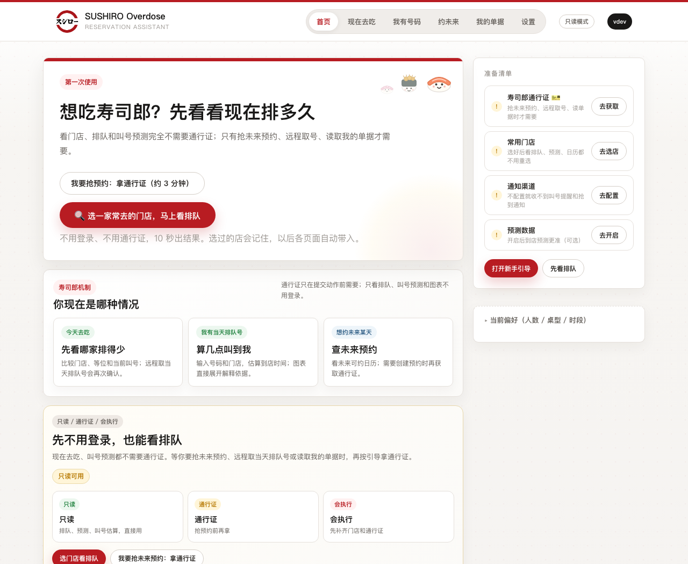
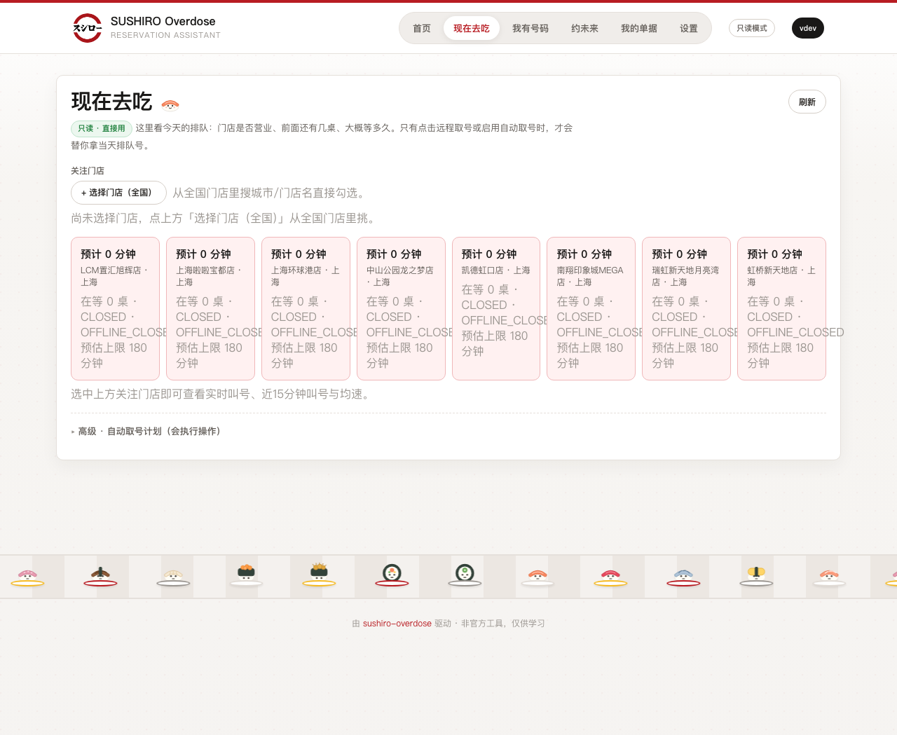
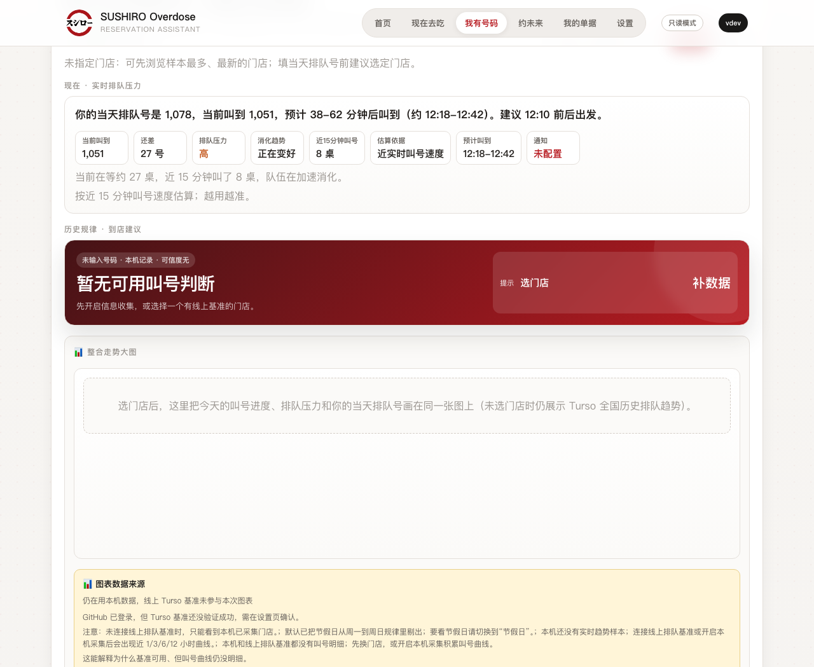

# 寿司郎排队助手（Sushiro Overdose）

吃寿司郎拿到号之后，告诉你大概几点叫到、几点该出门——不用一直盯着大屏自己算。

一个开源的桌面工具，macOS / Windows / Linux 都能用，用 Go 写的。

[](https://github.com/Ryujoxys/sushiro-overdose/releases/latest)
[](https://github.com/Ryujoxys/sushiro-overdose/actions/workflows/ci.yml)
[](#下载)
[](LICENSE)

> 🔒 **安全 / 开源可审计**：全部代码公开，没有联网上传你的数据，只读寿司郎本来就公开的排队信息。MITM 抓包**只解密寿司郎域名**，其他流量原样透传。任何会动你账号的操作（取号、预约）都会先弹窗确认，不会偷偷执行。详见[数据与隐私](#数据和隐私)和 [SECURITY.md](SECURITY.md)。

---

## 为什么会有这个东西

寿司郎拿号后，小票上只有号码，门店大屏只显示「当前叫到几号」。前面还剩多少桌、平均几分钟叫一个、我到底该几点出门——全得自己在心里算，算错的结果要么去太早干站着，要么慢悠悠晃过去发现早过号了。

这个工具就是把「叫号进度、前面剩多少桌、历史规律」这些本来就公开的数据算一下，给你一个能照做的出发时间。读的都是公开信息，不替你抢号、不碰别人账号、不往服务器上传。

<p align="center">
  
</p>

## 三种用法

### 1. 现在想去吃

不用登录，挑一家店就能看到开着没、排了几桌、大概等多久、这会儿挤不挤。盯着两家常去的，叫号快了再出门。

<p align="center">
  
</p>

### 2. 已经拿到号了（最常用）

把排队号填进去，工具告诉你大概多久叫到、几点前后出发。估算会参考最近的叫号速度和前面剩的桌数，跟着叫号进度一直更新：

> 1078 号，当前叫到 1051，预计 38-62 分钟后叫到（约 12:18-12:42）。建议 12:10 前后出发。

<p align="center">
  
</p>

快叫到了能推一条通知（飞书 / Telegram / Bark / Server酱，可以同时开），这样你不用一直守着屏幕，可以先找地方坐会儿。

### 3. 想约未来某天

部分门店能预约，但好时段一放出来就没了。工具能查未来哪些天、哪些时段还能约；没放出来的热门时段可以挂着等，一开放就帮你订上。这个场景需要「通行证」——从手机小程序取一次登录凭证让电脑替你操作，前两种用法都用不到它。

## 下载

<details>
<summary>Windows</summary>

下载 [latest release](https://github.com/Ryujoxys/sushiro-overdose/releases/latest) 里的 `Sushiro-Overdose-*-windows-amd64.exe`，双击运行。ARM 设备下载 `windows-arm64.exe`。

也可以用 PowerShell 一行安装：

```powershell
irm https://raw.githubusercontent.com/Ryujoxys/sushiro-overdose/master/install/install.ps1 | iex
```

首次运行如果遇到 SmartScreen 蓝屏，点 **「更多信息」** → 再点 **「仍要运行」**。

</details>

<details>
<summary>macOS</summary>

下载 [latest release](https://github.com/Ryujoxys/sushiro-overdose/releases/latest) 里的 `Sushiro-Overdose-*-macOS.dmg`，打开后拖到 Applications。

> ⚠️ **首次打开会被 macOS 拦，提示"无法验证开发者"——这不是安全问题，是没花钱买 Apple 开发者签名。**
>
> Apple 对未签名应用一律默认拦截（Gatekeeper），无论软件本身安不安全。本项目是开源的，代码全部可审计（见 [SECURITY.md](SECURITY.md)），不收集不上传任何个人数据。不放 App Store、不做公证签名是因为：① Apple 开发者账号要 $99/年，② 这个工具非商用、没收入。**所以需要你手动放行一次**，之后永久可用。三种放行方式任选其一：
>
> **方式一（推荐，最简单）**：双击 App 弹出「无法打开」后，打开 **系统设置 → 隐私与安全性**，往下滚会看到一条「已阻止使用 "Sushiro Overdose"」，点 **仍要打开**（可能要输密码）。之后再双击就能正常打开。
>
> **方式二**：在「访达 → 应用程序」里 **按住 Control 点按**（或右键）Sushiro Overdose → 选 **打开** → 弹窗里再点 **打开**。只需做一次，之后双击即可。
>
> **方式三（终端，最彻底）**：如果上面两种都没出现「仍要打开」按钮（新版 macOS 有时会），打开「终端」粘贴回车，直接去掉隔离标记：
>
> ```bash
> xattr -dr com.apple.quarantine "/Applications/Sushiro Overdose.app"
> ```

</details>

<details>
<summary>Linux</summary>

下载 `sushiro-overdose_*_linux_amd64.tar.gz` 解压运行，或执行：

```bash
curl -fsSL https://raw.githubusercontent.com/Ryujoxys/sushiro-overdose/master/install/install.sh | bash
```

</details>

<details>
<summary>从源码构建 / 本地部署（详细）</summary>

**前置要求**：Go 1.23+（[下载](https://go.dev/dl/)，或 `brew install go` / `choco install golang`）。本项目零外部依赖，纯标准库，不需要装任何第三方库。

```bash
git clone https://github.com/Ryujoxys/sushiro-overdose.git
cd sushiro-overdose
go build -o sushiro .
./sushiro
```

运行后会自动打开浏览器（或弹独立窗口），地址默认是 `http://127.0.0.1:39871`。

**各平台运行**：

- **macOS / Linux**：`./sushiro`（如提示"无法验证开发者"，见上方的 macOS 放行说明）
- **Windows**（PowerShell / CMD）：`go build -o sushiro.exe .` 然后 `.\sushiro.exe`；想后台无控制台窗口，加 `-ldflags "-H windowsgui"`

**命令行参数**：

```bash
./sushiro              # 默认启动 Web UI（最常用）
./sushiro web          # 同上，显式指定
./sushiro --sampler-daemon-child   # 采样守护进程（一般不用手动跑，UI 里开）
```

**改端口**：默认从 `39871` 起，被占会自动递增。想固定端口或排查冲突：

```bash
# 先确认 39871 没被占
lsof -i :39871        # macOS/Linux
netstat -ano | findstr 39871   # Windows
```

程序只会绑定 `127.0.0.1`（本机回环），不会对外网监听，所以**别的设备访问不了**，这是刻意的安全设计。

**数据存哪**：配置、本地采样历史、凭证都在用户目录下（`~/.sushiro/`，Windows 是 `%USERPROFILE%\.sushiro\`），删这个目录等于重置。日志在同目录的 `sushiro-log.txt`。

**验证构建是否正常**：

```bash
go test ./...     # 跑全部测试
go vet ./...      # 静态检查
gofmt -l .        # 格式（无输出=OK）
```

**更新到最新版**：`git pull && go build -o sushiro .` 即可，数据目录不受影响。

</details>

装好双击运行，会自动弹出网页界面。搜城市或门店名挑一家店，没号就看排队，有号就把号填进去。想要到点提醒，去设置里填一个通知地址就行。

---

下面是进阶内容，普通使用看到这里就够了。

## 通行证是什么

只看排队和叫号预测不用登录。需要「动账号」的操作（预约、远程取号、取消、读我的单据）才会用到通行证——从寿司郎微信小程序请求里提取的一次凭证。

凭证会过期，也可能被手机重新登录小程序后顶掉。出现这些情况时，在设置里重置认证再重新获取就行：

- 官方接口返回 `E010 / error.server`
- 返回 401 / 403
- 远程取号或自动预约突然失败
- 手机端重新打开过寿司郎小程序后，电脑端旧凭证失效

Windows 上一般用手机抓包导入，macOS 可以先试 PC 微信自动捕获，向导会一步步提示。任何会动账号的操作，点之前都会再确认一次。

## 数据和隐私

- 排队和叫号信息本来就公开，小程序里也显示，工具只是读出来算一下
- 凭证只存在你自己电脑（`~/.sushiro/`），不上传任何第三方服务器
- 软件开源，代码都能看，没有后台偷偷上传
- 远程抢预约和取号走寿司郎官方接口，和你用手机操作一样

本机数据默认在 `~/.sushiro/` 下：`config.json`（凭证）、`notify.json`（通知配置）、`preferences.json`（偏好）、`history.jsonl`（历史）、`queue_observations.jsonl`（排队快照）、`cloud_auth.json`（Worker 地址 + GitHub session，不含数据库 token）、`auth_meta.json`（凭证年龄与捕获方式，用于到期前提醒，不含凭证本体）、`eta_open.json` 与 `eta_backtest.jsonl`（预测准确度自测：记录「预测 vs 实际叫到」用于校准区间，只存号码和时间，不含个人信息）。

如果自建 Cloudflare Worker + Turso 做线上基准，只读数据库 token 应放在 Worker Secrets，客户端只存 Worker URL 和登录 session。

## 命令行

图形界面之外，也能用命令行：

```bash
sushiro                 # 启动 Web UI
sushiro cli             # 终端交互模式
sushiro calendar        # 查看可预约时段
sushiro list            # 查看当前预约
sushiro cancel <id>     # 取消预约
sushiro sample once     # 采集一次排队/时段数据
sushiro doctor          # 只读诊断
sushiro repair-proxy    # 恢复系统代理
sushiro uninstall       # 清理本地敏感数据和证书
sushiro help            # 更多命令
```

## 遇到问题

| 现象 | 处理 |
|------|------|
| 打不开页面 | 重新运行，端口冲突会自动换端口 |
| 系统代理异常 | 运行 `sushiro repair-proxy`，或设置页点代理修复 |
| 通知收不到 | 设置页点「测试通知」，确认 Webhook / Token 正确 |
| 取号失败 E010 | 先重置认证，再重新获取通行证 |
| macOS 打不开 App | 右键 App → 打开；或「系统设置 → 隐私与安全性 → 仍要打开」；还不行跑 `xattr -dr com.apple.quarantine "/Applications/Sushiro Overdose.app"` |
| Windows 被拦截 | SmartScreen 点「更多信息」→「仍要运行」；或把 exe 加进杀毒白名单 |

更详细的诊断跑 `sushiro doctor`。

## 开发

```bash
go build ./...
go test ./...
go vet ./...
```

架构和文件职责见 [AGENTS.md](AGENTS.md) 与 [ARCHITECTURE.md](ARCHITECTURE.md)。

发新版本：

```bash
git tag vX.Y.Z
git push origin vX.Y.Z
```

GitHub Actions 会自动构建 macOS / Windows / Linux 产物并创建 Release。

## License

MIT
